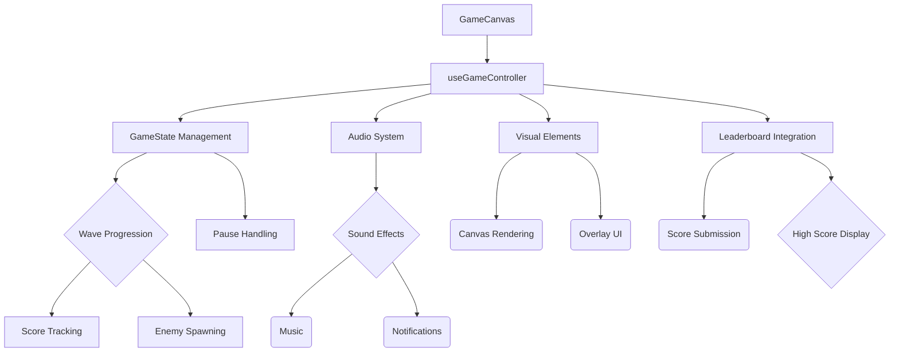

### 📂 Module / Domain: Game Engine Core

#### 1. Business Logic & Core Domain Rules

##### Core User Needs:
- Engage in immersive game play with strategic enemy AI
- Progress through waves of increasing difficulty
- Collect resources (crystals) for upgrades
- Utilize pause functionality for strategic decisions
- Navigate seamlessly between game states (home/game/over)
- Submit high scores and view leaderboards

##### Game State Management Rules:
1. Wave Progression:
   - Start at wave 1, increment on successful completion
   - Show wave transition messages
   - Reset on player death or game over

2. Pause Mechanism:
   - Toggle pause state with P key
   - Prevents game state updates but maintains rendering
   - Shows/hides overlay instructions
   - Can be disabled by config for mobile optimization

3. Fullscreen Mode:
   - Toggle via F11 or button click
   - Maintains aspect ratio while scaling
   - Shows exit instructions and ESC key handler
   - Automatically adjusts canvas dimensions

4. Player State Management:
   - Initial state loaded from asset loader
   - Health, score, coins tracked in game state
   - Upgrades persist across waves
   - Stats reset on game over/restart

5. Score Submission:
   - Secure submission with client ID/time stamps
   - Prevents score spoofing via time window hashes
   - Shows modal for confirmation/skipping
   - Updates leaderboard after successful submission

##### Failure States & Recovery:
1. Game Over Conditions:
   - Player health reaches 0%
   - Wave progression fails due to network errors
   - Network errors in score submission after 3 retries

2. Error Handling:
   - Safe state reset on errors (timeout:5s)
   - Graceful degradation of game elements with fallback states
   - Clear user feedback for critical failures via overlay messages (max duration:10s)

#### 2. Architecture & Data Flow Diagram

#### 3. Functional Test Specification Matrix

| Feature               | Happy Path                                                                 | Boundary Edge Cases                                                        |
|-----------------------|---------------------------------------------------------------------------|------------------------------------------------------------------------------|
| Wave Progression      | Complete wave -> Next wave message appears                              | Max waves reached, score submission modal appears                       |
| Pause Mechanism       | P key toggles pause state -> overlay shows                             | Mobile view (if enabled), rapid toggle detection                          |
| Fullscreen Mode       | F11 toggles fullscreen -> dimensions adjust                            | Multiple toggles in quick succession, mobile viewport constraints        |
| Player State          | Stats persist across waves until game over                           | Negative health values, max coins reached                                |
| Score Submission      | Valid submission appears in leaderboard                               | Duplicate submissions, expired time windows                              |
| Audio Playback        | Sound effects and music play on relevant events                      | No audio device detected, network buffering delays                       |
| Visual Elements       | All UI elements render correctly in fullscreen                        | High DPI scaling issues, low-end hardware performance                    |
| Leaderboard Updates   | New scores appear after successful submission                         | Concurrent submissions, server-side validation failures                   |

This documentation provides the foundation for analyzing and improving the game engine core. Would you like me to propose specific improvements to any of these components?
